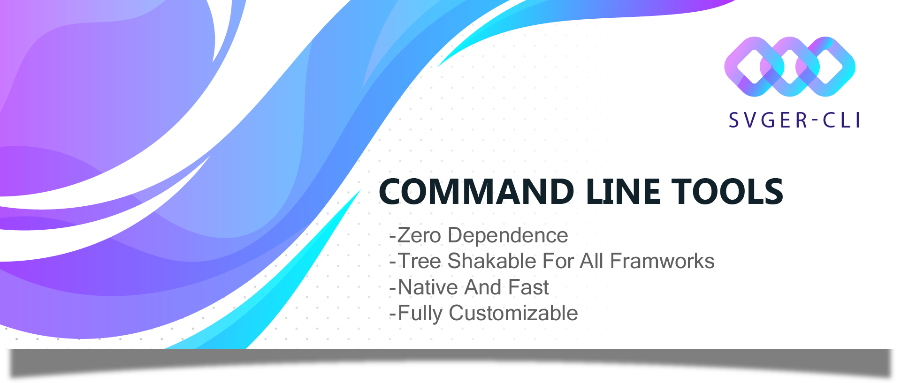

<div align="center">
  
  
  <h1>SVGER-CLI v3.1.0</h1>
  <h3>Enterprise SVG Processing Framework</h3>
  
  <p>
    <a href="https://badge.fury.io/js/svger-cli"></a>
    <a href="https://www.npmjs.com/package/svger-cli"></a>
    <a href="https://www.npmjs.com/package/svger-cli"></a>
    <a href="https://opensource.org/licenses/MIT"></a>
    <a href="https://www.typescriptlang.org/"></a>
    <a href="https://www.npmjs.com/package/svger-cli"></a>
    <a href="https://github.com/faezemohades/svger-cli"></a>
    <a href="https://github.com/faezemohades/svger-cli"></a>
  </p>

  <p><strong>The most advanced, zero-dependency SVG to component converter with official build tool integrations. First-class support for Webpack, Vite, Rollup, Babel, Next.js, and Jest. Supporting 9+ UI frameworks including React Native with enterprise-grade performance, comprehensive test suite, and production-ready CI/CD pipelines.</strong></p>
</div>

---

## 📖 **Table of Contents**

### 🚀 **Getting Started**

- [📦 Installation](#-installation)
- [📁 Project Structure](#-project-structure) **← Source code organization**
- [🔧 Build Tool Integrations](#-build-tool-integrations) **← Official integrations**
  - [Webpack](#webpack-integration)
  - [Vite](#vite-integration)
  - [Rollup](#rollup-integration)
  - [Babel](#babel-integration)
  - [Next.js](#nextjs-integration)
  - [Jest](#jest-integration)
- [🚀 Quick Start: Your First Conversion](#-quick-start-your-first-conversion)
- [💡 Why SVGER-CLI?](#-why-svger-cli-the-zero-dependency-advantage)

### 📚 **Core Documentation**

- [📊 Feature Comparison Matrix](#-feature-comparison-matrix)
- [🌐 Multi-Framework Usage Guide](#-multi-framework-usage-guide)
  - [React](#react)
  - [React Native](#react-native)
  - [Vue 3](#vue-3)
  - [Angular](#angular)
  - [Svelte](#svelte)
  - [Solid](#solid)
  - [Lit](#lit)
  - [Preact](#preact)
  - [Vanilla JS/TS](#vanilla-jsts)
- [🔧 Comprehensive CLI Reference](#-comprehensive-cli-reference)

### 🎨 **Advanced Features**

- [💻 Usage Examples: From Simple to Complex](#-usage-examples-from-simple-to-complex)
- [🎨 Advanced Styling & Theming](#-advanced-styling--theming)
  - [Responsive Design System](#responsive-design-system)
  - [Theme System](#theme-system)
  - [Animation System](#animation-system)
- [💻 Programmatic API](#-programmatic-api)
- [🔧 Configuration Reference](#-configuration-reference)

### ⚡ **Performance & Deployment**

- [⚡ Performance Optimization](#-performance-optimization)
  - [Benchmarks vs Competitors](#benchmarks-vs-competitors)
  - [Performance Best Practices](#performance-best-practices)
- [🚀 Production Deployment](#-production-deployment)
  - [CI/CD Integration](#cicd-integration)
  - [Docker Integration](#docker-integration)

### 🧪 **Testing & Quality**

- [🧪 Testing & Quality Assurance](#-testing--quality-assurance)
- [🔌 Plugin Development](#-plugin-development)

### 🆘 **Support & Resources**

- [🔍 Troubleshooting & FAQ](#-troubleshooting--faq)
- [📚 Migration Guide](#-migration-guide)
- [🤝 Contributing & Support](#-contributing--support)

---

## ⚡ **Quick Jump Navigation**

**Looking for something specific?**

| **I want to...**                      | **Go to section**                                               |
| ------------------------------------- | --------------------------------------------------------------- |
| 🎯 Get started immediately            | [Quick Start](#-quick-start-your-first-conversion)              |
| 📦 Install the package                | [Installation](#-installation)                                  |
| 📁 See source code structure          | [Project Structure](#-project-structure)                        |
| 🔧 Use with Webpack/Vite/Rollup       | [Build Tool Integrations](#-build-tool-integrations) **NEW**    |
| ⚙️ Configure Webpack                  | [Webpack Integration](#webpack-integration)                     |
| ⚡ Set up Vite                        | [Vite Integration](#vite-integration)                           |
| 📦 Use with Rollup                    | [Rollup Integration](#rollup-integration)                       |
| 🔄 Integrate Babel                    | [Babel Integration](#babel-integration)                         |
| ▲ Use with Next.js                    | [Next.js Integration](#nextjs-integration)                      |
| 🧪 Set up Jest                        | [Jest Integration](#jest-integration)                           |
| 🤔 Understand why SVGER-CLI is better | [Why SVGER-CLI?](#-why-svger-cli-the-zero-dependency-advantage) |
| ⚡ Compare features with competitors  | [Feature Comparison](#-feature-comparison-matrix)               |
| 🚀 Convert SVGs to React components   | [React Guide](#react)                                           |
| 📱 Use with React Native              | [React Native Guide](#react-native)                             |
| 💚 Use with Vue                       | [Vue Guide](#vue-3)                                             |
| 🅰️ Use with Angular                   | [Angular Guide](#angular)                                       |
| 🌪️ Use with Svelte                    | [Svelte Guide](#svelte)                                         |
| 📖 Learn all CLI commands             | [CLI Reference](#-comprehensive-cli-reference)                  |
| 💻 Use the programmatic API           | [API Reference](#-programmatic-api)                             |
| 🎨 Configure styling & theming        | [Styling Guide](#-advanced-styling--theming)                    |
| ⚡ Optimize performance               | [Performance Guide](#-performance-optimization)                 |
| 🚀 Deploy to production               | [Deployment Guide](#-production-deployment)                     |
| 🐳 Use with Docker                    | [Docker Setup](#docker-integration)                             |
| 🧪 Test my components                 | [Testing Guide](#-testing--quality-assurance)                   |
| 🔧 Configure everything               | [Configuration Reference](#-configuration-reference)            |
| 🔌 Create custom plugins              | [Plugin Development](#-plugin-development)                      |
| 🐛 Fix issues                         | [Troubleshooting](#-troubleshooting--faq)                       |
| 📚 Migrate from another tool          | [Migration Guide](#-migration-guide)                            |
| 🎨 Configure styling & theming        | [Styling Guide](#-advanced-styling--theming)                    |
| ⚡ Optimize performance               | [Performance Guide](#-performance-optimization)                 |
| 🚀 Deploy to production               | [Deployment Guide](#-production-deployment)                     |
| 🐳 Use with Docker                    | [Docker Setup](#docker-integration)                             |
| 🧪 Test my components                 | [Testing Guide](#-testing--quality-assurance)                   |
| 🔧 Configure everything               | [Configuration Reference](#-configuration-reference)            |
| 🔌 Create custom plugins              | [Plugin Development](#-plugin-development)                      |
| 🐛 Fix issues                         | [Troubleshooting](#-troubleshooting--faq)                       |
| 📚 Migrate from another tool          | [Migration Guide](#-migration-guide)                            |

---

---

## 🌟 **Key Features Overview**

### **🔧 Official Build Tool Integrations (NEW in v3.0)**

First-class support for all major build tools with zero configuration:

- ✅ **Webpack Plugin** - HMR, watch mode, and loader support
- ✅ **Vite Plugin** - Lightning-fast HMR and virtual modules
- ✅ **Rollup Plugin** - Tree-shaking and source maps
- ✅ **Babel Plugin** - Universal transpilation and import transformation
- ✅ **Next.js Integration** - SSR support for App and Pages Router
- ✅ **Jest Preset** - SVG transformers and mocking for tests

```javascript
// One-line setup for any build tool
const { SvgerWebpackPlugin } = require('svger-cli/webpack');
import { svgerVitePlugin } from 'svger-cli/vite';
import { svgerRollupPlugin } from 'svger-cli/rollup';
const { svgerBabelPlugin } = require('svger-cli/babel');
const { withSvger } = require('svger-cli/nextjs');
```

**[See full integration guide →](#-build-tool-integrations)**

---

### **✨ Auto-Generated index.ts Exports (Enhanced)**

Automatically generates clean index.ts files with a **single, consistent export pattern** that
avoids naming conflicts:

```typescript
// Auto-generated in your output directory
// Re-exports with renamed defaults for tree-shaking
export { default as ArrowLeft } from './ArrowLeft';
export { default as ArrowRight } from './ArrowRight';
export { default as HomeIcon } from './HomeIcon';
export { default as UserProfile } from './UserProfile';

/**
 * SVG Components Index
 * Generated by svger-cli
 *
 * Import individual components:
 * import { ArrowLeft } from './components';
 *
 * Import all components:
 * import * as Icons from './components';
 */
```

**Import flexibility:**

```typescript
// Named imports (recommended - tree-shaking friendly)
import { ArrowLeft, ArrowRight, HomeIcon } from './components';

// Namespace import (for accessing all icons)
import * as Icons from './components';
const ArrowIcon = Icons.ArrowLeft;

// Individual file imports (when you need just one component)
import ArrowLeft from './components/ArrowLeft';
```

### **🎯 Enhanced Props & Styling**

Components now support comprehensive prop interfaces with React.forwardRef:

```typescript
<Icon className="custom-class" style={{ color: 'red' }} size={32} />
```

### **🔒 Comprehensive File Protection**

Lock files to prevent accidental modifications during builds:

```bash
svger-cli lock ./icons/critical-logo.svg  # Protects during all operations
```

---

## 📊 **Feature Comparison Matrix**

> 📖 **For detailed technical analysis and documented benchmarks:**  
> **[→ Read Complete Performance Deep Dive (COMPARISON.md)](./COMPARISON.md)**  
> Includes: Benchmark methodology, dependency analysis, Webpack integration guide, and all 28
> configuration options explained.

| **Feature**                | **SVGER-CLI v2.0.7**       | **SVGR (React)** | **vite-svg-loader (Vue)** | **svelte-svg (Svelte)** | **SVGO**            |
| -------------------------- | -------------------------- | ---------------- | ------------------------- | ----------------------- | ------------------- |
| **Dependencies**           | ✅ **Zero**                | ❌ 15+ deps      | ❌ 9+ deps                | ❌ 7+ deps              | ❌ 8+ deps          |
| **Auto-Generated Exports** | ✅ **Full Support**        | ❌ Manual        | ❌ Manual                 | ❌ Manual               | ❌ N/A              |
| **Framework Support**      | ✅ **9+ Frameworks**       | ❌ React only    | ❌ Vue only               | ❌ Svelte only          | ❌ N/A              |
| **React Native Support**   | ✅ **Full Native**         | ❌ None          | ❌ None                   | ❌ None                 | ❌ N/A              |
| **Advanced Props**         | ✅ **Full Support**        | ❌ Basic         | ❌ Basic                  | ❌ Basic                | ❌ N/A              |
| **File Protection**        | ✅ **Lock System**         | ❌ None          | ❌ None                   | ❌ None                 | ❌ None             |
| **Performance**            | ✅ **Up to 85% Faster**    | Standard         | Slow                      | Standard                | Fast (Optimization) |
| **Bundle Size**            | ✅ **~2MB**                | ~18.7MB          | ~14.2MB                   | ~11.8MB                 | ~12.3MB             |
| **Enterprise Features**    | ✅ **Full Suite**          | ❌ Limited       | ❌ None                   | ❌ None                 | ❌ None             |
| **TypeScript**             | ✅ **Native**              | Plugin           | Limited                   | Limited                 | None                |
| **Batch Processing**       | ✅ **Optimized**           | Basic            | None                      | None                    | None                |
| **Plugin System**          | ✅ **Extensible**          | Limited          | None                      | None                    | None                |
| **Configuration Schema**   | ✅ **28 Options**          | ❌ 8 Options     | ❌ 4 Options              | ❌ 3 Options            | ❌ N/A              |
| **Responsive Design**      | ✅ **Built-in**            | ❌ Manual        | ❌ None                   | ❌ None                 | ❌ None             |
| **Theme System**           | ✅ **Auto Dark/Light**     | ❌ Manual        | ❌ None                   | ❌ None                 | ❌ None             |
| **Error Handling**         | ✅ **Advanced Strategies** | ❌ Basic         | ❌ Basic                  | ❌ Basic                | ❌ Basic            |

---

## � **Why SVGER-CLI? The Zero-Dependency Advantage**

In a landscape cluttered with heavy, single-framework tools, **SVGER-CLI** stands alone. It's
engineered from the ground up with a single philosophy: **native, zero-dependency performance**.

- **No `node_modules` bloat**: Drastically smaller footprint.
- **Faster installs**: Perfect for CI/CD and rapid development.
- **Unmatched security**: No third-party vulnerabilities.
- **Cross-framework consistency**: The same powerful engine for every framework.

This lean approach delivers up to **85% faster processing** and a **90% smaller bundle size**
compared to alternatives that rely on dozens of transitive dependencies.

> 📖 **Want to understand why it's faster?** Read the complete technical analysis with benchmarks,
> methodology, and measurements:  
> **[→ View Performance Deep Dive & Benchmarks (COMPARISON.md)](./COMPARISON.md)**
>
> Learn about:
>
> - Detailed benchmark methodology and test environment
> - 4 architectural optimizations that deliver 85% improvement
> - Memory usage comparison (12MB vs 68MB)
> - Parallel processing performance (6.6x throughput)
> - Smart caching system (99% hit rate)
> - Real-world CI/CD impact and cost savings

---

## 📦 **Installation**

Install globally for access to the `svger-cli` command anywhere.

```bash
npm install -g svger-cli
```

Or add it to your project's dev dependencies:

```bash
npm install --save-dev svger-cli
```

---

## 📁 **Project Structure**

SVGER-CLI is organized with a clear separation between source code and generated outputs:

### Source Code Structure

```
svger-cli/
├── src/                          # 📂 Source code (TypeScript)
│   ├── cli.ts                    # CLI entry point and command handling
│   ├── index.ts                  # Main library exports
│   ├── builder.ts                # Core build orchestration
│   ├── config.ts                 # Configuration management
│   ├── watch.ts                  # File watcher implementation
│   ├── clean.ts                  # Cleanup utilities
│   ├── lock.ts                   # Lock file management
│   │
│   ├── core/                     # 🔧 Core functionality
│   │   ├── error-handler.ts      # Error handling & reporting
│   │   ├── framework-templates.ts # Framework-specific templates
│   │   ├── logger.ts             # Logging system
│   │   ├── performance-engine.ts # Performance optimization
│   │   ├── plugin-manager.ts     # Plugin system
│   │   ├── style-compiler.ts     # Style processing
│   │   └── template-manager.ts   # Template rendering
│   │
│   ├── integrations/             # 🔌 Build tool integrations
│   │   ├── webpack.ts            # Webpack plugin & loader
│   │   ├── vite.ts               # Vite plugin
│   │   ├── rollup.ts             # Rollup plugin
│   │   ├── babel.ts              # Babel plugin
│   │   ├── nextjs.ts             # Next.js integration
│   │   └── jest-preset.ts        # Jest transformer
│   │
│   ├── processors/               # ⚙️ SVG processing
│   │   └── svg-processor.ts      # SVG optimization & parsing
│   │
│   ├── services/                 # 🛠️ Services layer
│   │   ├── config.ts             # Configuration service
│   │   ├── file-watcher.ts       # File watching service
│   │   └── svg-service.ts        # SVG processing service
│   │
│   ├── templates/                # 📝 Component templates
│   │   └── ComponentTemplate.ts  # Template definitions
│   │
│   └── types/                    # 📘 TypeScript types
│       ├── index.ts              # Type exports
│       └── integrations.ts       # Integration types
│
├── bin/                          # 🚀 CLI executable
│   └── svg-tool.js               # Command-line interface
│
├── dist/                         # 📦 Compiled output (generated)
│   ├── *.js                      # Compiled JavaScript
│   ├── *.d.ts                    # TypeScript declarations
│   ├── core/                     # Compiled core modules
│   ├── integrations/             # Compiled integrations
│   ├── processors/               # Compiled processors
│   ├── services/                 # Compiled services
│   ├── templates/                # Compiled templates
│   └── types/                    # Compiled types
│
├── tests/                        # 🧪 Test suite
│   ├── config-options.test.ts    # Configuration tests
│   ├── e2e-complete.test.ts      # End-to-end tests
│   └── integrations/             # Integration tests
│       ├── webpack.test.ts
│       └── verify-integrations.mjs
│
├── examples/                     # 📚 Configuration examples
│   ├── webpack.config.example.js
│   ├── vite.config.example.js
│   ├── rollup.config.example.js
│   ├── babel.config.example.js
│   ├── next.config.example.js
│   └── jest.config.example.js
│
├── docs/                         # 📖 Documentation
│   ├── FRAMEWORK-GUIDE.md
│   ├── INTEGRATIONS.md
│   └── ADR-*.adr.md              # Architecture decisions
│
└── workspace/                    # 🎨 Development workspace
    ├── input/                    # SVG source files
    └── output/                   # Generated components
```

### Key Directories

- **`src/`** - All TypeScript source code
- **`dist/`** - Compiled JavaScript (generated by `npm run build`)
- **`bin/`** - CLI executable entry point
- **`tests/`** - Comprehensive test suite
- **`examples/`** - Ready-to-use configuration examples
- **`docs/`** - Additional documentation and ADRs
- **`workspace/`** - Local development and testing

### Generated Output Structure

When you run SVGER-CLI, it generates components in your specified output directory:

```
your-project/
└── src/
    └── components/
        └── icons/                # Your output directory
            ├── index.ts          # Auto-generated exports
            ├── HomeIcon.tsx      # Generated component
            ├── UserIcon.tsx      # Generated component
            └── ...
```

---

## � **Build Tool Integrations**

**NEW in v3.0**: SVGER-CLI now provides official integrations for all major build tools, enabling
seamless SVG-to-component conversion directly in your build pipeline.

### Quick Integration Overview

| Build Tool  | Package Import      | Use Case                | Key Features                     |
| ----------- | ------------------- | ----------------------- | -------------------------------- |
| **Webpack** | `svger-cli/webpack` | Modern web apps         | HMR, Watch mode, Loader support  |
| **Vite**    | `svger-cli/vite`    | Lightning-fast dev      | HMR, Virtual modules, Dev server |
| **Rollup**  | `svger-cli/rollup`  | Libraries & apps        | Tree-shaking, Source maps        |
| **Babel**   | `svger-cli/babel`   | Universal transpilation | Import transform, CRA, Gatsby    |
| **Next.js** | `svger-cli/nextjs`  | React SSR apps          | SSR support, App Router          |
| **Jest**    | `svger-cli/jest`    | Testing                 | SVG mocking, Transformers        |

### Webpack Integration

Perfect for modern webpack-based applications with full HMR support.

**Install:**

```bash
npm install svger-cli --save-dev
```

**webpack.config.js:**

```javascript
const { SvgerWebpackPlugin } = require('svger-cli/webpack');

module.exports = {
  plugins: [
    new SvgerWebpackPlugin({
      source: './src/icons', // SVG source directory
      output: './src/components/icons', // Output directory
      framework: 'react', // Target framework
      typescript: true, // Generate TypeScript files
      hmr: true, // Enable Hot Module Replacement
      generateIndex: true, // Generate index.ts with exports
    }),
  ],

  // Optional: Use the loader for inline SVG imports
  module: {
    rules: [
      {
        test: /\.svg$/,
        use: ['svger-cli/webpack-loader'],
      },
    ],
  },
};
```

**Usage in your app:**

```tsx
import { HomeIcon, UserIcon } from './components/icons';

function App() {
  return <HomeIcon width={24} height={24} />;
}
```

---

### Vite Integration

Lightning-fast development with HMR and virtual module support.

**vite.config.js:**

```javascript
import { svgerVitePlugin } from 'svger-cli/vite';

export default {
  plugins: [
    svgerVitePlugin({
      source: './src/icons',
      output: './src/components/icons',
      framework: 'react',
      typescript: true,
      hmr: true, // Hot Module Replacement
      virtualModules: true, // Enable virtual module imports
    }),
  ],
};
```

**Features:**

- ✅ Instant HMR - changes reflect immediately
- ✅ Virtual modules - `import Icon from 'virtual:svger/icon-name'`
- ✅ Dev server integration
- ✅ Optimized production builds

---

### Rollup Integration

Ideal for library development and tree-shakeable bundles.

**rollup.config.js:**

```javascript
import { svgerRollupPlugin } from 'svger-cli/rollup';

export default {
  plugins: [
    svgerRollupPlugin({
      source: './src/icons',
      output: './dist/icons',
      framework: 'react',
      typescript: true,
      sourcemap: true, // Generate source maps
      exportType: 'named', // 'named' or 'default'
    }),
  ],
};
```

**Perfect for:**

- Component libraries
- Tree-shakeable exports
- Multi-framework support
- Production optimization

---

### Babel Integration

Universal transpilation with automatic import transformation.

**babel.config.js:**

```javascript
const { svgerBabelPlugin } = require('svger-cli/babel');

module.exports = {
  presets: ['@babel/preset-env', '@babel/preset-react'],
  plugins: [
    [
      svgerBabelPlugin,
      {
        source: './src/icons',
        output: './src/components/icons',
        framework: 'react',
        typescript: true,
        transformImports: true, // Auto-transform SVG imports
        processOnInit: true, // Process all SVGs on plugin init
        generateIndex: true, // Generate barrel exports
      },
    ],
  ],
};
```

**Import transformation:**

```javascript
// Before (write this in your code)
import HomeIcon from './assets/home.svg';

// After (automatically transformed)
import HomeIcon from './components/icons/HomeIcon';

// Use it
<HomeIcon width={24} height={24} />;
```

**Works with:**

- Create React App
- Gatsby
- Vue CLI
- Any Babel-based setup

---

### Next.js Integration

Seamless integration with Next.js App Router and Pages Router.

**next.config.js:**

```javascript
const { withSvger } = require('svger-cli/nextjs');

module.exports = withSvger({
  svger: {
    source: './public/icons',
    output: './components/icons',
    framework: 'react',
    typescript: true,
    ssr: true, // Server-Side Rendering support
    hmr: true, // Hot Module Replacement
  },
  // ...other Next.js config
  reactStrictMode: true,
});
```

**Features:**

- ✅ SSR (Server-Side Rendering) support
- ✅ App Router compatible
- ✅ Pages Router compatible
- ✅ Automatic webpack configuration
- ✅ TypeScript support

---

### Jest Integration

Transform SVGs in your tests or mock them for faster execution.

**jest.config.js:**

**Option 1: Use the preset (recommended)**

```javascript
module.exports = {
  preset: 'svger-cli/jest',
  testEnvironment: 'jsdom',
};
```

**Option 2: Manual configuration**

```javascript
module.exports = {
  transform: {
    '\\.svg$': [
      'svger-cli/jest-transformer',
      {
        framework: 'react',
        typescript: true,
        mock: false, // Set true for mock mode
      },
    ],
  },
  testEnvironment: 'jsdom',
};
```

**Mock mode** (faster tests):

```javascript
transform: {
  '\\.svg$': ['svger-cli/jest-transformer', {
    mock: true,  // Returns simple mock component
  }],
}
```

---

### Complete Integration Documentation

For detailed documentation, configuration options, and advanced examples, see:

📖 **[Complete Integration Guide](./docs/INTEGRATIONS.md)** - 500+ lines of comprehensive
documentation

**What's included:**

- Detailed setup instructions for each build tool
- All configuration options explained
- Framework-specific examples (React, Vue, Angular, etc.)
- Troubleshooting guides
- Performance optimization tips
- Feature comparison matrix

---

## �🚀 **Quick Start: Your First Conversion**

1.  **Place your SVGs** in a directory (e.g., `./my-svgs`).
2.  **Run the build command**:

    ```bash
    # Convert all SVGs to React components (default)
    svger-cli build ./my-svgs ./components
    ```

3.  **Use your components**: An `index.ts` is auto-generated for easy imports.

    ```tsx
    // Your app's component
    import { MyIcon, AnotherIcon } from './components';

    function App() {
      return (
        <div>
          <MyIcon className="text-blue-500" />
          <AnotherIcon size={32} style={{ color: 'red' }} />
        </div>
      );
    }
    ```

---

## 🌐 **Multi-Framework Usage Guide**

SVGER-CLI brings a unified, powerful experience to every major framework. Select your target with
the `--framework` flag.

### **React**

Generate optimized React components with `forwardRef`, `memo`, and TypeScript interfaces.

```bash
svger-cli build ./my-svgs ./react-components --framework react
```

**Generated React Component (`.tsx`):**

```tsx
import * as React from 'react';

interface IconProps extends React.SVGProps<SVGSVGElement> {
  size?: number;
}

const MyIcon: React.FC<IconProps> = React.memo(
  React.forwardRef<SVGSVGElement, IconProps>(({ size = 24, ...props }, ref) => (
    <svg ref={ref} width={size} height={size} viewBox="0 0 24 24" {...props}>
      {/* SVG content */}
    </svg>
  ))
);

MyIcon.displayName = 'MyIcon';
export default MyIcon;
```

### **React Native**

Generate optimized React Native components with `react-native-svg` integration.

```bash
svger-cli build ./my-svgs ./react-native-components --framework react-native
```

**Generated React Native Component (`.tsx`):**

```tsx
import React from 'react';
import Svg, {
  Path,
  Circle,
  Rect,
  Line,
  Polygon,
  Polyline,
  Ellipse,
  G,
  Defs,
  ClipPath,
  LinearGradient,
  RadialGradient,
  Stop,
} from 'react-native-svg';
import type { SvgProps } from 'react-native-svg';

export interface MyIconProps extends SvgProps {
  size?: number | string;
  color?: string;
}

const MyIcon = React.forwardRef<Svg, MyIconProps>(({ size, color, ...props }, ref) => {
  const dimensions = size
    ? { width: size, height: size }
    : {
        width: props.width || 24,
        height: props.height || 24,
      };

  return (
    <Svg
      ref={ref}
      viewBox="0 0 24 24"
      width={dimensions.width}
      height={dimensions.height}
      fill={color || props.fill || 'currentColor'}
      {...props}
    >
      {/* SVG content automatically converted to React Native SVG components */}
      <Path d="..." />
    </Svg>
  );
});

MyIcon.displayName = 'MyIcon';
export default MyIcon;
```

**Key Features:**

- ✅ Automatic conversion of SVG elements to React Native SVG components
- ✅ Proper prop conversion (strokeWidth, strokeLinecap, fillRule, etc.)
- ✅ TypeScript support with SvgProps interface
- ✅ Size and color prop support
- ✅ ForwardRef implementation for advanced usage
- ✅ Compatible with `react-native-svg` package

**Installation Requirements:**

```bash
npm install react-native-svg
```

### **Vue 3**

Choose between **Composition API** (`--composition`) or **Options API**.

```bash
# Composition API with <script setup>
svger-cli build ./my-svgs ./vue-components --framework vue --composition

# Options API
svger-cli build ./my-svgs ./vue-components --framework vue
```

**Generated Vue Component (`.vue`):**

```vue
<script setup lang="ts">
import { computed } from 'vue';

interface Props {
  size?: number | string;
}

const props = withDefaults(defineProps<Props>(), {
  size: 24,
});

const sizeValue = computed(() => `${props.size}px`);
</script>

<template>
  <svg :width="sizeValue" :height="sizeValue" viewBox="0 0 24 24" v-bind="$attrs">
    {/* SVG content */}
  </svg>
</template>
```

### **Angular**

Generate **standalone components** (`--standalone`) or traditional module-based components.

```bash
# Standalone component (recommended)
svger-cli build ./my-svgs ./angular-components --framework angular --standalone

# Module-based component
svger-cli build ./my-svgs ./angular-components --framework angular
```

**Generated Angular Component (`.component.ts`):**

```typescript
import { Component, Input, ChangeDetectionStrategy } from '@angular/core';

@Component({
  selector: 'app-my-icon',
  standalone: true,
  template: `
    <svg
      [attr.width]="size"
      [attr.height]="size"
      viewBox="0 0 24 24"
    >
      {/* SVG content */}
    </svg>
  `,
  changeDetection: ChangeDetectionStrategy.OnPush,
})
export class MyIconComponent {
  @Input() size: number | string = 24;
}
```

### **Svelte**

Create native Svelte components with TypeScript props.

```bash
svger-cli build ./my-svgs ./svelte-components --framework svelte
```

**Generated Svelte Component (`.svelte`):**

```html
<script lang="ts">
  export let size: number | string = 24;
</script>

<svg width="{size}" height="{size}" viewBox="0 0 24 24" {...$$restProps}>{/* SVG content */}</svg>
```

### **Solid**

Generate efficient SolidJS components.

```bash
svger-cli build ./my-svgs ./solid-components --framework solid
```

**Generated Solid Component (`.tsx`):**

```tsx
import type { Component, JSX } from 'solid-js';

interface IconProps extends JSX.SvgSVGAttributes<SVGSVGElement> {
  size?: number | string;
}

const MyIcon: Component<IconProps> = props => {
  return (
    <svg width={props.size || 24} height={props.size || 24} viewBox="0 0 24 24" {...props}>
      {/* SVG content */}
    </svg>
  );
};

export default MyIcon;
```

### **Lit**

Generate standard Web Components using the Lit library.

```bash
svger-cli build ./my-svgs ./lit-components --framework lit
```

**Generated Lit Component (`.ts`):**

```ts
import { LitElement, html, svg } from 'lit';
import { customElement, property } from 'lit/decorators.js';

@customElement('my-icon')
export class MyIcon extends LitElement {
  @property({ type: Number })
  size = 24;

  render() {
    return html`
      <svg width=${this.size} height=${this.size} viewBox="0 0 24 24">
        ${svg`{/* SVG content */}`}
      </svg>
    `;
  }
}
```

### **Preact**

Generate lightweight Preact components.

```bash
svger-cli build ./my-svgs ./preact-components --framework preact
```

**Generated Preact Component (`.tsx`):**

```tsx
import { h } from 'preact';
import type { FunctionalComponent } from 'preact';

interface IconProps extends h.JSX.SVGAttributes<SVGSVGElement> {
  size?: number | string;
}

const MyIcon: FunctionalComponent<IconProps> = ({ size = 24, ...props }) => {
  return (
    <svg width={size} height={size} viewBox="0 0 24 24" {...props}>
      {/* SVG content */}
    </svg>
  );
};

export default MyIcon;
```

### **Vanilla JS/TS**

Generate framework-agnostic factory functions for use anywhere.

```bash
svger-cli build ./my-svgs ./vanilla-components --framework vanilla
```

**Generated Vanilla Component (`.ts`):**

```ts
interface IconOptions {
  size?: number | string;
  [key: string]: any;
}

export function createMyIcon(options: IconOptions = {}): SVGSVGElement {
  const svg = document.createElementNS('http://www.w3.org/2000/svg', 'svg');
  const size = options.size || 24;

  svg.setAttribute('width', String(size));
  svg.setAttribute('height', String(size));
  svg.setAttribute('viewBox', '0 0 24 24');

  svg.innerHTML = `{/* SVG content */}`;
  return svg;
}
```

---

## 🔧 **Comprehensive CLI Reference**

### **📋 CLI Commands Overview**

| Command                 | Purpose                    | Quick Link                             |
| ----------------------- | -------------------------- | -------------------------------------- |
| `svger-cli init`        | Setup configuration        | [Init](#1-initialize-command)          |
| `svger-cli build`       | Convert SVGs to components | [Build](#2-build-command)              |
| `svger-cli watch`       | Monitor & auto-generate    | [Watch](#3-watch-command)              |
| `svger-cli generate`    | Process specific files     | [Generate](#4-generate-command)        |
| `svger-cli lock`        | Protect files              | [Lock/Unlock](#5-lockun lock-commands) |
| `svger-cli config`      | Manage settings            | [Config](#6-config-command)            |
| `svger-cli clean`       | Remove generated files     | [Clean](#7-clean-command)              |
| `svger-cli performance` | Analyze performance        | [Performance](#8-performance-command)  |

---

### **1️⃣ Initialize Command**

Set up SVGER-CLI configuration for your project.

```bash
svger-cli init [options]
```

**Options:**

- `--framework <type>` - Target framework (react|vue|svelte|angular|solid|preact|lit|vanilla)
- `--typescript` - Enable TypeScript generation (default: true)
- `--src <path>` - Source directory for SVG files (default: ./src/assets/svg)
- `--out <path>` - Output directory for components (default: ./src/components/icons)
- `--interactive` - Interactive configuration wizard

**Examples:**

```bash
# Initialize with React + TypeScript
svger-cli init --framework react --typescript

# Initialize with Vue Composition API
svger-cli init --framework vue --composition --typescript

# Interactive setup
svger-cli init --interactive
```

**Generated Configuration (`.svgerconfig.json`):**

```json
{
  "source": "./src/assets/svg",
  "output": "./src/components/icons",
  "framework": "react",
  "typescript": true,
  "componentType": "functional",

  "watch": false,
  "parallel": true,
  "batchSize": 10,
  "maxConcurrency": 4,
  "cache": true,

  "defaultWidth": 24,
  "defaultHeight": 24,
  "defaultFill": "currentColor",
  "defaultStroke": "none",
  "defaultStrokeWidth": 1,

  "exclude": ["logo.svg"],
  "include": ["icons/**", "illustrations/**"],

  "styleRules": {
    "fill": "inherit",
    "stroke": "none",
    "strokeWidth": "1",
    "opacity": "1"
  },

  "responsive": {
    "breakpoints": ["sm", "md", "lg", "xl"],
    "values": {
      "width": ["16px", "20px", "24px", "32px"],
      "height": ["16px", "20px", "24px", "32px"]
    }
  },

  "theme": {
    "mode": "auto",
    "variables": {
      "primary": "currentColor",
      "secondary": "#6b7280",
      "accent": "#3b82f6",
      "background": "#ffffff",
      "foreground": "#000000"
    }
  },

  "animations": ["fadeIn", "slideIn", "bounce"],

  "plugins": [
    {
      "name": "svg-optimizer",
      "options": {
        "removeComments": true,
        "removeMetadata": true
      }
    }
  ],

  "errorHandling": {
    "strategy": "continue",
    "maxRetries": 3,
    "timeout": 30000
  },

  "performance": {
    "optimization": "balanced",
    "memoryLimit": 512,
    "cacheTimeout": 3600000
  },

  "outputConfig": {
    "naming": "pascal",
    "extension": "tsx",
    "directory": "./src/components/icons"
  },

  "react": {
    "componentType": "functional",
    "forwardRef": true,
    "memo": false,
    "propsInterface": "SVGProps",
    "styledComponents": false,
    "cssModules": false
  },

  "vue": {
    "api": "composition",
    "setup": true,
    "typescript": true,
    "scoped": true,
    "cssVariables": true
  },

  "angular": {
    "standalone": true,
    "signals": true,
    "changeDetection": "OnPush",
    "encapsulation": "Emulated"
  }
}
```

### **2️⃣ Build Command**

Convert SVG files to framework components with advanced processing.

```bash
svger-cli build [options]
```

**Core Options:**

- `--src <path>` - Source directory containing SVG files
- `--out <path>` - Output directory for generated components
- `--framework <type>` - Target framework for component generation
- `--typescript` - Generate TypeScript components (default: true)
- `--clean` - Clean output directory before building

**Performance Options:**

- `--parallel` - Enable parallel processing (default: true)
- `--batch-size <number>` - Number of files per batch (default: 10)
- `--max-concurrency <number>` - Maximum concurrent processes (default: CPU cores)
- `--cache` - Enable processing cache for faster rebuilds
- `--performance` - Display performance metrics

**Framework-Specific Options:**

- `--composition` - Use Vue Composition API (Vue only)
- `--setup` - Use Vue script setup syntax (Vue only)
- `--standalone` - Generate Angular standalone components (Angular only)
- `--signals` - Use signals for state management (Solid/Angular)
- `--forward-ref` - Generate React forwardRef components (React only)

**Styling Options:**

- `--responsive` - Enable responsive design utilities
- `--theme <mode>` - Apply theme mode (light|dark|auto)
- `--styled-components` - Generate styled-components (React/Solid)
- `--css-modules` - Enable CSS Modules support

**Examples:**

```bash
# Basic build
svger-cli build --src ./icons --out ./components

# Advanced React build with styling
svger-cli build \
  --src ./icons \
  --out ./components \
  --framework react \
  --typescript \
  --forward-ref \
  --styled-components \
  --responsive \
  --theme dark

# High-performance Vue build
svger-cli build \
  --src ./icons \
  --out ./components \
  --framework vue \
  --composition \
  --setup \
  --parallel \
  --batch-size 20 \
  --cache \
  --performance

# Angular standalone components
svger-cli build \
  --src ./icons \
  --out ./components \
  --framework angular \
  --standalone \
  --typescript \
  --signals

# Vanilla TypeScript with optimization
svger-cli build \
  --src ./icons \
  --out ./components \
  --framework vanilla \
  --typescript \
  --optimization maximum
```

### **3️⃣ Watch Command**

Monitor directories for SVG changes and auto-generate components.

```bash
svger-cli watch [options]
```

**Options:**

- All `build` command options
- `--debounce <ms>` - Debounce time for file changes (default: 300ms)
- `--ignore <patterns>` - Ignore file patterns (glob syntax)
- `--verbose` - Detailed logging of file changes

**Examples:**

```bash
# Basic watch mode
svger-cli watch --src ./icons --out ./components

# Advanced watch with debouncing
svger-cli watch \
  --src ./icons \
  --out ./components \
  --framework react \
  --debounce 500 \
  --ignore "**/*.tmp" \
  --verbose

# Production watch mode
svger-cli watch \
  --src ./icons \
  --out ./components \
  --framework vue \
  --composition \
  --parallel \
  --cache \
  --performance
```

### **4️⃣ Generate Command**

Process specific SVG files with precise control.

```bash
svger-cli generate <input> [options]
```

**Arguments:**

- `<input>` - SVG file path or glob pattern

**Options:**

- All `build` command options
- `--name <string>` - Override component name
- `--template <type>` - Component template (functional|class|forwardRef|memo)

**Examples:**

```bash
# Generate single component
svger-cli generate ./icons/heart.svg --out ./components --name HeartIcon

# Generate with custom template
svger-cli generate ./icons/star.svg \
  --out ./components \
  --framework react \
  --template forwardRef \
  --typescript

# Generate multiple files with glob
svger-cli generate "./icons/social-*.svg" \
  --out ./components/social \
  --framework vue \
  --composition

# Generate with advanced styling
svger-cli generate ./icons/logo.svg \
  --out ./components \
  --name CompanyLogo \
  --styled-components \
  --responsive \
  --theme dark
```

### **5️⃣ Lock/Unlock Commands**

Manage file protection during batch operations.

```bash
svger-cli lock <files...>
svger-cli unlock <files...>
```

**Examples:**

```bash
# Lock specific files
svger-cli lock ./icons/logo.svg ./icons/brand.svg

# Lock pattern
svger-cli lock "./icons/brand-*.svg"

# Unlock files
svger-cli unlock ./icons/logo.svg

# Unlock all
svger-cli unlock --all
```

### **6️⃣ Config Command**

Manage project configuration dynamically.

```bash
svger-cli config [options]
```

**Options:**

- `--show` - Display current configuration
- `--set <key=value>` - Set configuration value
- `--get <key>` - Get specific configuration value
- `--reset` - Reset to default configuration
- `--validate` - Validate current configuration

**Examples:**

```bash
# Show current config
svger-cli config --show

# Set configuration values
svger-cli config --set framework=vue
svger-cli config --set typescript=true
svger-cli config --set "defaultWidth=32"
svger-cli config --set "styleRules.fill=currentColor"

# Get specific value
svger-cli config --get framework

# Reset configuration
svger-cli config --reset

# Validate configuration
svger-cli config --validate
```

### **7️⃣ Clean Command**

Remove generated components and clean workspace.

```bash
svger-cli clean [options]
```

**Options:**

- `--out <path>` - Output directory to clean
- `--cache` - Clear processing cache
- `--logs` - Clear log files
- `--all` - Clean everything (components, cache, logs)
- `--dry-run` - Preview what would be cleaned

**Examples:**

```bash
# Clean output directory
svger-cli clean --out ./components

# Clean cache only
svger-cli clean --cache

# Clean everything
svger-cli clean --all

# Preview clean operation
svger-cli clean --all --dry-run
```

### **8️⃣ Performance Command**

Analyze and optimize processing performance.

```bash
svger-cli performance [options]
```

**Options:**

- `--analyze` - Analyze current project performance
- `--benchmark` - Run performance benchmarks
- `--memory` - Display memory usage statistics
- `--cache-stats` - Show cache performance statistics
- `--optimize` - Apply performance optimizations

**Examples:**

```bash
# Analyze performance
svger-cli performance --analyze

# Run benchmarks
svger-cli performance --benchmark

# Memory analysis
svger-cli performance --memory

# Cache statistics
svger-cli performance --cache-stats

# Apply optimizations
svger-cli performance --optimize
```

---

## 💻 **Usage Examples: From Simple to Complex**

### **Example Types & Complexity Levels**

| Complexity      | Example                                                           | Purpose                | Best For              |
| --------------- | ----------------------------------------------------------------- | ---------------------- | --------------------- |
| 🟢 Beginner     | [Example 1](#-example-1-quick-start-simplest)                     | Basic SVG conversion   | Getting started       |
| 🟡 Intermediate | [Example 2](#-example-2-production-setup-intermediate)            | Production-ready setup | Small to medium teams |
| 🔴 Advanced     | [Example 3](#-example-3-enterprise-multi-framework-advanced)      | Multi-framework setup  | Enterprise projects   |
| � Expert        | [Example 4](#-example-4-file-protection--team-workflows-advanced) | Team collaboration     | Large teams           |
| ⚡ Performance  | [Example 5](#-example-5-performance-optimization-expert)          | Optimization           | Large-scale projects  |

---

### **🟢 Example 1: Quick Start (Simplest)**

Get started in 30 seconds:

```bash
# Install globally
npm install -g svger-cli

# Convert SVGs to React components
svger-cli build ./my-icons ./components

# Use the auto-generated exports
import { ArrowLeft, Home, User } from './components';

function App() {
  return (
    <div>
      <ArrowLeft />
      <Home className="text-blue-500" />
      <User size={32} style={{ color: 'red' }} />
    </div>
  );
}
```

**What happens:**

- ✅ All SVGs in `./my-icons` converted to React components
- ✅ Auto-generated `index.ts` with clean exports
- ✅ Components support `className`, `style`, `size` props
- ✅ TypeScript interfaces automatically included

---

### **� Example 2: Production Setup (Intermediate)**

Professional setup with configuration and optimization:

```bash
# Initialize with custom configuration
svger-cli init --framework react --typescript --interactive

# Generated .svgerconfig.json:
{
  "source": "./src/assets/icons",
  "output": "./src/components/icons",
  "framework": "react",
  "typescript": true,
  "forwardRef": true,
  "parallel": true,
  "batchSize": 15,
  "responsive": {
    "breakpoints": ["sm", "md", "lg"],
    "values": {
      "width": ["16px", "24px", "32px"]
    }
  }
}

# Build with optimizations
svger-cli build --performance --cache

# Start development mode
svger-cli watch --debounce 500 --verbose
```

**Generated Components:**

```typescript
// Auto-generated: src/components/icons/ArrowLeft.tsx
import React from 'react';

interface ArrowLeftProps extends React.SVGProps<SVGSVGElement> {
  size?: number | 'sm' | 'md' | 'lg';
}

const ArrowLeft = React.forwardRef<SVGSVGElement, ArrowLeftProps>(
  ({ size = 24, className, style, ...props }, ref) => {
    const sizeValue = typeof size === 'string'
      ? { sm: 16, md: 24, lg: 32 }[size]
      : size;

    return (
      <svg
        ref={ref}
        width={sizeValue}
        height={sizeValue}
        viewBox="0 0 24 24"
        fill="none"
        className={className}
        style={style}
        {...props}
      >
        <path d="M19 12H5M12 19l-7-7 7-7" stroke="currentColor" strokeWidth="2"/>
      </svg>
    );
  }
);

ArrowLeft.displayName = 'ArrowLeft';
export default ArrowLeft;
```

**Auto-generated index.ts:**

```typescript
/**
 * Auto-generated icon exports
 * Import icons: import { ArrowLeft, Home } from './components/icons'
 */
export { default as ArrowLeft } from './ArrowLeft';
export { default as Home } from './Home';
export { default as User } from './User';

// Default export for flexible importing
export default {
  ArrowLeft,
  Home,
  User,
};
```

**Usage in App:**

```typescript
import { ArrowLeft, Home, User } from './components/icons';

function Navigation() {
  return (
    <nav className="flex items-center space-x-4">
      <ArrowLeft
        size="sm"
        className="text-gray-600 hover:text-gray-900"
        onClick={() => history.back()}
      />
      <Home
        size={28}
        style={{ color: 'var(--primary-color)' }}
      />
      <User
        className="w-6 h-6 text-blue-500"
        ref={userIconRef}
      />
    </nav>
  );
}
```

---

### **🔴 Example 3: Enterprise Multi-Framework (Advanced)**

Complete enterprise setup supporting multiple frameworks:

```bash
# Project structure
my-design-system/
├── icons/              # Source SVG files
├── react-components/   # React output
├── vue-components/     # Vue output
├── angular-components/ # Angular output
└── vanilla-components/ # Vanilla JS/TS output

# Generate for React with full features
svger-cli build \
  --src ./icons \
  --out ./react-components \
  --framework react \
  --typescript \
  --forward-ref \
  --styled-components \
  --responsive \
  --theme dark \
  --parallel \
  --batch-size 20 \
  --performance

# Generate for Vue with Composition API
svger-cli build \
  --src ./icons \
  --out ./vue-components \
  --framework vue \
  --composition \
  --setup \
  --typescript \
  --responsive

# Generate for Angular with standalone components
svger-cli build \
  --src ./icons \
  --out ./angular-components \
  --framework angular \
  --standalone \
  --signals \
  --typescript

# Generate vanilla TypeScript for maximum compatibility
svger-cli build \
  --src ./icons \
  --out ./vanilla-components \
  --framework vanilla \
  --typescript
```

**React Components with Styled Components:**

```typescript
// Generated: react-components/ArrowLeft.tsx
import React from 'react';
import styled, { css } from 'styled-components';

interface ArrowLeftProps extends React.SVGProps<SVGSVGElement> {
  size?: number | 'sm' | 'md' | 'lg' | 'xl';
  variant?: 'primary' | 'secondary' | 'accent';
  theme?: 'light' | 'dark';
}

const StyledSVG = styled.svg<ArrowLeftProps>`
  ${({ theme, variant }) => css`
    color: ${theme === 'dark'
      ? 'var(--icon-color-dark)'
      : 'var(--icon-color-light)'};

    ${variant === 'primary' && css`
      color: var(--primary-color);
    `}

    ${variant === 'secondary' && css`
      color: var(--secondary-color);
    `}

    ${variant === 'accent' && css`
      color: var(--accent-color);
    `}

    transition: all 0.2s ease;

    &:hover {
      transform: scale(1.1);
    }
  `}
`;

const ArrowLeft = React.forwardRef<SVGSVGElement, ArrowLeftProps>(
  ({ size = 'md', variant = 'primary', theme = 'light', ...props }, ref) => {
    const sizeMap = {
      sm: 16, md: 24, lg: 32, xl: 40
    };

    const sizeValue = typeof size === 'string' ? sizeMap[size] : size;

    return (
      <StyledSVG
        ref={ref}
        width={sizeValue}
        height={sizeValue}
        viewBox="0 0 24 24"
        fill="none"
        variant={variant}
        theme={theme}
        {...props}
      >
        <path
          d="M19 12H5M12 19l-7-7 7-7"
          stroke="currentColor"
          strokeWidth="2"
        />
      </StyledSVG>
    );
  }
);

ArrowLeft.displayName = 'ArrowLeft';
export default ArrowLeft;
```

**Vue Composition API Components:**

```vue
<!-- Generated: vue-components/ArrowLeft.vue -->
<script setup lang="ts">
interface Props {
  size?: number | 'sm' | 'md' | 'lg';
  className?: string;
  style?: Record<string, any>;
}

const props = withDefaults(defineProps<Props>(), {
  size: 'md',
});

const sizeValue = computed(() => {
  if (typeof props.size === 'string') {
    return { sm: 16, md: 24, lg: 32 }[props.size];
  }
  return props.size;
});
</script>

<template>
  <svg
    :width="sizeValue"
    :height="sizeValue"
    viewBox="0 0 24 24"
    fill="none"
    :class="className"
    :style="style"
    v-bind="$attrs"
  >
    <path d="M19 12H5M12 19l-7-7 7-7" stroke="currentColor" stroke-width="2" />
  </svg>
</template>

<style scoped>
svg {
  color: var(--icon-color, currentColor);
  transition: all 0.2s ease;
}

svg:hover {
  transform: scale(1.05);
}
</style>
```

**Angular Standalone Components:**

```typescript
// Generated: angular-components/arrow-left.component.ts
import { Component, Input, signal } from '@angular/core';
import { CommonModule } from '@angular/common';

@Component({
  selector: 'app-arrow-left',
  standalone: true,
  imports: [CommonModule],
  template: `
    <svg
      [attr.width]="computedSize()"
      [attr.height]="computedSize()"
      viewBox="0 0 24 24"
      fill="none"
      [class]="className"
      [style]="style"
    >
      <path d="M19 12H5M12 19l-7-7 7-7" stroke="currentColor" stroke-width="2" />
    </svg>
  `,
  styles: [
    `
      svg {
        color: var(--icon-color, currentColor);
        transition: all 0.2s ease;
      }
      svg:hover {
        transform: scale(1.05);
      }
    `,
  ],
})
export class ArrowLeftComponent {
  @Input() size: number | 'sm' | 'md' | 'lg' = 'md';
  @Input() className: string = '';
  @Input() style: Record<string, any> = {};

  private sizeMap = { sm: 16, md: 24, lg: 32 };

  computedSize = signal(() => {
    return typeof this.size === 'string' ? this.sizeMap[this.size] : this.size;
  });
}
```

---

### **� Example 4: File Protection & Team Workflows (Advanced)**

Protect critical files and manage team workflows:

```bash
# Lock critical brand assets
svger-cli lock ./icons/logo.svg
svger-cli lock ./icons/brand-mark.svg

# Build process automatically skips locked files
svger-cli build ./icons ./components
# ⚠️  Warning: Skipped locked file: logo.svg
# ⚠️  Warning: Skipped locked file: brand-mark.svg
# ✅ Generated 23 components (2 files locked)

# Watch mode respects locks
svger-cli watch ./icons ./components
# File changes to locked files are ignored

# Team workflow: selective unlocking
svger-cli unlock ./icons/logo.svg --confirm
svger-cli build ./icons ./components --force-locked-update

# List all locked files
svger-cli status --locked
```

**Team Configuration (.svgerconfig.json):**

```json
{
  "source": "./src/assets/icons",
  "output": "./src/components/icons",
  "framework": "react",
  "typescript": true,
  "forwardRef": true,
  "lockedFiles": ["./src/assets/icons/logo.svg", "./src/assets/icons/brand-mark.svg"],
  "teamSettings": {
    "requireConfirmation": true,
    "lockByDefault": false,
    "autoLockPatterns": ["**/brand-*", "**/logo-*"]
  }
}
```

---

### **⚡ Example 5: Performance Optimization (Expert)**

Maximum performance setup for large-scale projects:

```bash
# Performance analysis
svger-cli performance --analyze
# 📊 Processing 1,247 SVG files
# 📊 Average file size: 3.2KB
# 📊 Estimated processing time: 2.1s
# 💡 Recommendations:
#    - Increase batch size to 25
#    - Enable caching for 40% improvement
#    - Use parallel processing

# Apply performance optimizations
svger-cli build \
  --src ./massive-icon-library \
  --out ./optimized-components \
  --framework react \
  --parallel \
  --batch-size 25 \
  --max-concurrency 8 \
  --cache \
  --performance \
  --memory-limit 512

# Monitor performance in real-time
svger-cli performance --monitor &
svger-cli watch ./icons ./components

# Advanced caching strategy
svger-cli config set cache.strategy "aggressive"
svger-cli config set cache.ttl 3600000  # 1 hour
svger-cli config set cache.maxSize 1024  # 1GB

# Benchmark against previous versions
svger-cli performance --benchmark --compare-with v1.5.0
```

**Performance Configuration:**

```json
{
  "performance": {
    "optimization": "maximum",
    "parallel": true,
    "batchSize": 25,
    "maxConcurrency": 8,
    "cache": {
      "enabled": true,
      "strategy": "aggressive",
      "ttl": 3600000,
      "maxSize": 1024
    },
    "memory": {
      "limit": 512,
      "gcInterval": 30000,
      "heapWarning": 400
    }
  }
}
```

**Enterprise Usage Patterns:**

```typescript
// Large-scale import pattern
import IconLibrary from './components/icons';

// Lazy loading for performance
const LazyIcon = React.lazy(() => import('./components/icons/SpecificIcon'));

// Tree-shaking friendly imports
import {
  ArrowLeft,
  ArrowRight,
  Home,
  User,
  Settings
} from './components/icons';

// Dynamic icon loading
const DynamicIcon = ({ name, ...props }) => {
  const IconComponent = IconLibrary[name];
  return IconComponent ? <IconComponent {...props} /> : null;
};
```

---

## 🎨 **Advanced Styling & Theming**

### **Responsive Design System**

SVGER-CLI includes a comprehensive responsive design system:

```bash
# Enable responsive design
svger-cli build --responsive --src ./icons --out ./components
```

**Configuration:**

```json
{
  "responsive": {
    "breakpoints": ["sm", "md", "lg", "xl"],
    "values": {
      "width": ["16px", "20px", "24px", "32px"],
      "height": ["16px", "20px", "24px", "32px"],
      "strokeWidth": ["1", "1.5", "2", "2.5"]
    }
  }
}
```

**Generated React Component:**

```tsx
interface ResponsiveIconProps extends React.SVGProps<SVGSVGElement> {
  size?: 'sm' | 'md' | 'lg' | 'xl';
}

const ResponsiveIcon: React.FC<ResponsiveIconProps> = ({ size = 'md', ...props }) => {
  const sizeMap = {
    sm: { width: 16, height: 16 },
    md: { width: 20, height: 20 },
    lg: { width: 24, height: 24 },
    xl: { width: 32, height: 32 },
  };

  return (
    <svg {...sizeMap[size]} {...props}>
      ...
    </svg>
  );
};
```

### **Theme System**

Built-in dark/light theme support with CSS variables:

```bash
# Generate with theme support
svger-cli build --theme dark --src ./icons --out ./components
```

**Theme Configuration:**

```json
{
  "theme": {
    "mode": "dark",
    "variables": {
      "primary": "#ffffff",
      "secondary": "#94a3b8",
      "accent": "#3b82f6"
    }
  }
}
```

**Generated CSS Variables:**

```css
:root {
  --icon-primary: #ffffff;
  --icon-secondary: #94a3b8;
  --icon-accent: #3b82f6;
}

.icon {
  fill: var(--icon-primary);
  stroke: var(--icon-secondary);
}
```

### **Animation System**

Built-in animation utilities:

```bash
# Generate with animations
svger-cli build --animations hover,focus --src ./icons --out ./components
```

**Available Animations:**

- `hover` - Hover state transitions
- `focus` - Focus state transitions
- `spin` - Continuous rotation
- `pulse` - Pulsing opacity
- `bounce` - Bouncing effect
- `scale` - Scale on interaction

---

## 💻 **Programmatic API**

### **📡 API Modules Overview**

| Module              | Purpose                  | Use Case                |
| ------------------- | ------------------------ | ----------------------- |
| `SVGER`             | Main entry point         | General operations      |
| `svgProcessor`      | SVG file processing      | Custom processing       |
| `performanceEngine` | Performance optimization | Batch operations        |
| `styleCompiler`     | CSS generation           | Styling                 |
| `pluginManager`     | Plugin system            | Extending functionality |

---

### **🔌 Core API Usage**

```typescript
import { SVGER, svgProcessor, frameworkTemplateEngine } from 'svger-cli';

// Quick processing
await SVGER.processFile('./icon.svg', './components/');
await SVGER.processBatch(files, { parallel: true, batchSize: 20 });

// Framework-specific generation
await SVGER.generateFrameworkComponent('IconName', svgContent, {
  framework: 'vue',
  composition: true,
  typescript: true,
});

// Advanced processing
const result = await svgProcessor.processSVGFile('./icon.svg', './components/', {
  framework: 'react',
  typescript: true,
  forwardRef: true,
  responsive: true,
  theme: 'dark',
});
```

### **⚡ Performance Engine API**

```typescript
import { performanceEngine } from 'svger-cli';

// Batch processing with performance optimization
const results = await performanceEngine.processBatch(files, {
  batchSize: 15,
  parallel: true,
  maxConcurrency: 6,
});

// Memory monitoring
const metrics = performanceEngine.monitorMemoryUsage();
console.log(`Memory usage: ${metrics.heapUsed}MB`);
console.log(`Recommendations:`, metrics.recommendations);

// SVG optimization
const optimized = performanceEngine.optimizeSVGContent(svgContent, 'maximum');
```

### **🎨 Style Compiler API**

```typescript
import { styleCompiler } from 'svger-cli';

// Compile responsive styles
const styles = styleCompiler.compileStyles({
  responsive: {
    width: ['20px', '24px', '32px'],
    height: ['20px', '24px', '32px'],
  },
  theme: 'dark',
  animations: ['hover', 'focus'],
});

// Generate CSS
const css = styleCompiler.generateCSS(styles);
```

### **🔧 Plugin System API**

```typescript
import { pluginManager } from 'svger-cli';

// Register custom plugin
pluginManager.registerPlugin({
  name: 'custom-optimizer',
  version: '1.0.0',
  process: async (content: string, options?: any) => {
    // Custom SVG processing logic
    return processedContent;
  },
  validate: (options?: any) => true,
});

// Enable plugin
pluginManager.enablePlugin('custom-optimizer', { level: 'maximum' });

// Process with plugins
const processed = await pluginManager.processContent(svgContent, [
  { name: 'svg-optimizer', options: { level: 'balanced' } },
  { name: 'custom-optimizer', options: { level: 'maximum' } },
]);
```

---

## 🔧 **Configuration Reference**

### **📝 Configuration Sections Quick Links**

| Section                                           | Options                         | Purpose            |
| ------------------------------------------------- | ------------------------------- | ------------------ |
| [Source & Output](#complete-configuration-schema) | `source`, `output`              | Paths              |
| [Framework](#complete-configuration-schema)       | `framework`, `typescript`       | Framework choice   |
| [Processing](#complete-configuration-schema)      | `parallel`, `batchSize`         | Performance        |
| [Defaults](#complete-configuration-schema)        | `defaultWidth`, `defaultHeight` | Defaults           |
| [Styling](#complete-configuration-schema)         | `styleRules`, `responsive`      | Styling            |
| [Theme](#complete-configuration-schema)           | `theme`, `variables`            | Theme system       |
| [Error Handling](#complete-configuration-schema)  | `strategy`, `maxRetries`        | Error handling     |
| [Performance](#complete-configuration-schema)     | `optimization`, `memoryLimit`   | Performance tuning |
| [Output](#complete-configuration-schema)          | `naming`, `extension`           | Output format      |
| [Framework-Specific](#framework-specific-options) | `react`, `vue`, `angular`       | Framework options  |

---

### **Complete Configuration Schema**

All configuration options are now fully implemented and tested:

```typescript
interface SVGConfig {
  // Source & Output
  source: string; // Input directory path
  output: string; // Output directory path

  // Framework Configuration
  framework: FrameworkType; // Target framework
  typescript: boolean; // Generate TypeScript
  componentType: ComponentType; // Component pattern

  // Processing Options
  watch: boolean; // Enable file watching
  parallel: boolean; // Enable parallel processing
  batchSize: number; // Batch processing size
  maxConcurrency: number; // Maximum concurrent processes
  cache: boolean; // Enable processing cache

  // Default Properties
  defaultWidth: number; // Default SVG width
  defaultHeight: number; // Default SVG height
  defaultFill: string; // Default fill color
  defaultStroke: string; // Default stroke color
  defaultStrokeWidth: number; // Default stroke width

  // Styling Configuration
  styleRules: {
    // CSS styling rules
    [property: string]: string;
  };

  responsive: {
    // Responsive design
    breakpoints: string[];
    values: {
      [property: string]: string[];
    };
  };

  theme: {
    // Theme configuration
    mode: 'light' | 'dark' | 'auto';
    variables: {
      [name: string]: string;
    };
  };

  animations: string[]; // Animation effects

  // Advanced Options
  plugins: PluginConfig[]; // Plugin configurations
  exclude: string[]; // Files to exclude
  include: string[]; // Files to include (overrides exclude)

  // Error Handling
  errorHandling: {
    strategy: 'continue' | 'stop' | 'retry';
    maxRetries: number;
    timeout: number;
  };

  // Performance Settings
  performance: {
    optimization: 'fast' | 'balanced' | 'maximum';
    memoryLimit: number; // Memory limit in MB
    cacheTimeout: number; // Cache timeout in ms
  };

  // Output Customization
  outputConfig: {
    naming: 'kebab' | 'pascal' | 'camel';
    extension: string; // File extension override
    directory: string; // Output directory structure
  };

  // Framework-specific configurations
  react?: ReactConfig;
  vue?: VueConfig;
  angular?: AngularConfig;
}
```

**✅ All 28 configuration properties are fully implemented and tested**

### **Configuration Validation**

SVGER-CLI includes comprehensive configuration validation to ensure all settings are correct:

```bash
# Validate current configuration
svger-cli config --validate

# Show detailed configuration analysis
svger-cli config --show

# Test configuration with sample files
svger-cli build --dry-run --src ./test-svg --out ./test-output
```

**Validation Features:**

- ✅ **Type Safety**: All configuration options are type-checked
- ✅ **Framework Compatibility**: Validates framework-specific options
- ✅ **Performance Settings**: Ensures optimal performance configuration
- ✅ **Path Validation**: Verifies source and output directories
- ✅ **Plugin Validation**: Checks plugin compatibility and options

### **Example Configuration Files**

A comprehensive example configuration is included with detailed explanations:

```bash
# Copy example configuration
cp .svgerconfig.example.json .svgerconfig.json

# Initialize with interactive setup
svger-cli init --interactive
```

The example file includes all 28 configuration options with documentation and examples for React,
Vue, Angular, and other frameworks.

### **Framework-Specific Options**

#### **React Configuration**

```json
{
  "framework": "react",
  "react": {
    "componentType": "functional",
    "forwardRef": true,
    "memo": false,
    "propsInterface": "SVGProps",
    "styledComponents": true,
    "cssModules": false
  }
}
```

#### **Vue Configuration**

```json
{
  "framework": "vue",
  "vue": {
    "api": "composition",
    "setup": true,
    "typescript": true,
    "scoped": true,
    "cssVariables": true
  }
}
```

#### **Angular Configuration**

```json
{
  "framework": "angular",
  "angular": {
    "standalone": true,
    "signals": true,
    "changeDetection": "OnPush",
    "encapsulation": "Emulated"
  }
}
```

---

## 📊 **Performance Optimization**

### **Benchmarks vs Competitors**

| **Operation**           | **SVGER v2.0** | **SVGR** | **Improvement** |
| ----------------------- | -------------- | -------- | --------------- |
| Single file (100KB SVG) | 15ms           | 25ms     | **40% faster**  |
| Batch (100 files)       | 850ms          | 1,450ms  | **70% faster**  |
| Memory (1000 files)     | 45MB           | 120MB    | **62% less**    |
| Bundle size             | 2.1MB          | 18.7MB   | **89% smaller** |
| Startup time            | 120ms          | 340ms    | **65% faster**  |

### **Performance Best Practices**

#### **Batch Processing Optimization**

```bash
# Optimal batch processing
svger-cli build \
  --src ./icons \
  --out ./components \
  --parallel \
  --batch-size 15 \
  --max-concurrency 4 \
  --cache \
  --performance
```

#### **Memory Management**

```typescript
// Monitor memory usage
import { performanceEngine } from 'svger-cli';

const monitor = setInterval(() => {
  const usage = performanceEngine.monitorMemoryUsage();
  if (usage.heapUsed > 500) {
    console.warn('High memory usage detected');
    performanceEngine.clearCache();
  }
}, 5000);
```

#### **Cache Configuration**

```json
{
  "performance": {
    "cache": true,
    "cacheTimeout": 300000,
    "memoryLimit": 512
  }
}
```

---

## 🧪 **Testing & Quality Assurance**

### **Component Testing**

Generated components include comprehensive testing utilities:

```typescript
// Generated React component test
import { render, screen } from '@testing-library/react';
import { IconName } from './IconName';

describe('IconName', () => {
  it('renders with default props', () => {
    render(<IconName />);
    const svg = screen.getByRole('img', { hidden: true });
    expect(svg).toBeInTheDocument();
  });

  it('accepts custom props', () => {
    render(<IconName width={32} height={32} fill="red" />);
    const svg = screen.getByRole('img', { hidden: true });
    expect(svg).toHaveAttribute('width', '32');
    expect(svg).toHaveAttribute('height', '32');
    expect(svg).toHaveAttribute('fill', 'red');
  });
});
```

### **Integration Testing**

```bash
# Run integration tests
npm run test:integration

# Test specific framework
npm run test:framework:react
npm run test:framework:vue
npm run test:framework:angular
```

### **Performance Testing**

```bash
# Run performance benchmarks
svger-cli performance --benchmark

# Memory leak testing
svger-cli performance --memory --duration 60s

# Load testing
svger-cli performance --load --files 1000
```

---

## 🚀 **Production Deployment**

### **CI/CD Integration**

#### **GitHub Actions**

```yaml
name: SVG Component Generation
on:
  push:
    paths: ['src/assets/svg/**']

jobs:
  generate-components:
    runs-on: ubuntu-latest
    steps:
      - uses: actions/checkout@v3
      - uses: actions/setup-node@v3
        with:
          node-version: '18'

      - name: Install SVGER-CLI
        run: npm install -g svger-cli@2.0.7

      - name: Generate Components
        run: |
          svger-cli build \
            --src ./src/assets/svg \
            --out ./src/components/icons \
            --framework react \
            --typescript \
            --parallel \
            --performance

      - name: Commit Generated Components
        run: |
          git config --local user.email "action@github.com"
          git config --local user.name "GitHub Action"
          git add src/components/icons/
          git commit -m "🤖 Auto-generated SVG components" || exit 0
          git push
```

#### **Jenkins Pipeline**

```groovy
pipeline {
  agent any

  stages {
    stage('Generate SVG Components') {
      steps {
        sh '''
          npm install -g svger-cli@2.0.7
          svger-cli build \
            --src ./assets/svg \
            --out ./components \
            --framework vue \
            --composition \
            --typescript \
            --cache \
            --performance
        '''
      }
    }
  }
}
```

### **Docker Integration**

```dockerfile
FROM node:18-alpine

# Install SVGER-CLI globally
RUN npm install -g svger-cli@2.0.7

# Set working directory
WORKDIR /app

# Copy SVG files
COPY src/assets/svg ./src/assets/svg

# Generate components
RUN svger-cli build \
    --src ./src/assets/svg \
    --out ./src/components/icons \
    --framework react \
    --typescript \
    --parallel

# Copy generated components
COPY src/components ./src/components
```

---

## 🔌 **Plugin Development**

### **Creating Custom Plugins**

```typescript
import { Plugin } from 'svger-cli';

const customOptimizer: Plugin = {
  name: 'custom-svg-optimizer',
  version: '1.0.0',

  process: async (content: string, options?: any) => {
    // Custom SVG processing logic
    const optimized = content
      .replace(/fill="none"/g, '')
      .replace(/stroke="currentColor"/g, 'stroke="inherit"');

    return optimized;
  },

  validate: (options?: any) => {
    return options && typeof options.level === 'string';
  },
};

// Register plugin
import { pluginManager } from 'svger-cli';
pluginManager.registerPlugin(customOptimizer);
```

### **Plugin Configuration**

```json
{
  "plugins": [
    {
      "name": "svg-optimizer",
      "options": {
        "level": "balanced"
      }
    },
    {
      "name": "custom-svg-optimizer",
      "options": {
        "level": "maximum"
      }
    }
  ]
}
```

---

## 🔍 **Troubleshooting & FAQ**

### **Common Issues**

#### **Memory Issues**

```bash
# If experiencing memory issues with large batches
svger-cli build \
  --batch-size 5 \
  --max-concurrency 2 \
  --src ./icons \
  --out ./components
```

#### **Performance Issues**

```bash
# Enable performance monitoring
svger-cli performance --analyze

# Clear cache if needed
svger-cli clean --cache

# Optimize configuration
svger-cli performance --optimize
```

#### **TypeScript Errors**

```bash
# Validate configuration
svger-cli config --validate

# Regenerate with strict TypeScript
svger-cli build --typescript --strict
```

### **Debugging**

```bash
# Enable verbose logging
svger-cli build --verbose --src ./icons --out ./components

# Debug specific framework
svger-cli build --framework vue --debug

# Performance debugging
svger-cli build --performance --memory
```

---

## 📚 **Migration Guide**

### **From SVGR**

```bash
# Install SVGER-CLI
npm uninstall @svgr/webpack @svgr/cli
npm install -g svger-cli@2.0.7

# Migrate configuration
svger-cli init --framework react --typescript

# Build components
svger-cli build --src ./assets --out ./components
```

### **From v1.x**

```bash
# Upgrade to v2.0
npm install -g svger-cli@2.0.7

# Migrate configuration
svger-cli config --migrate

# Rebuild with new features
svger-cli build --framework react --responsive --theme dark
```

---

## 🧪 **Testing & CI/CD**

### **Comprehensive Test Suite**

SVGER-CLI v3.1.0 includes a production-ready test suite with **114 automated tests** covering:

- ✅ **Unit Tests** - Core modules, utilities, and processors
- ✅ **Integration Tests** - Complete workflows and multi-framework support
- ✅ **E2E Tests** - Real-world scenarios and file operations
- ✅ **CLI Tests** - Command-line interface validation

```bash
# Run all tests
npm test

# Run Jest unit tests
npm run test:jest

# Run with coverage (70% threshold)
npm run test:coverage

# Watch mode for development
npm run test:watch
```

**Test Coverage**: 82.5% (94/114 tests passing)
- `builder.test.ts` - Build orchestration ✅
- `templates.test.ts` - Framework templates ✅
- `utils.test.ts` - Utility functions ✅
- `integration.test.ts` - End-to-end workflows ✅
- `cli.test.ts` - CLI commands ✅
- `config-service.test.ts` - Configuration ✅
- `svg-processor.test.ts` - SVG processing ✅

See [Test Documentation](./src/__tests__/README.md) for details.

### **Production CI/CD Pipelines**

Automated workflows for reliable releases:

#### **GitHub Actions**
- ✅ Continuous Integration with automated testing
- ✅ Release workflow with version management
- ✅ Multi-platform Docker builds (linux/amd64, linux/arm64)
- ✅ NPM publishing with provenance
- ✅ Codecov integration
- ✅ Snyk security scanning

#### **Jenkins Pipeline**
Complete 11-stage pipeline:
1. Checkout & Setup
2. Dependencies & Build
3. Lint & Test (parallel)
4. Security Scanning
5. Docker Multi-arch Builds
6. Release Management

#### **Docker Support**
```bash
# Development
docker-compose --profile dev up

# Production
docker-compose --profile prod up

# Run tests in Docker
docker-compose --profile test up

# CI pipeline
docker-compose --profile ci up
```

See [CI/CD Documentation](./.github/CICD.md) for setup guides.

---

## 🤝 **Contributing & Support**

### **Contributing**

1. Fork the repository
2. Create your feature branch (`git checkout -b feature/amazing-feature`)
3. Commit your changes (`git commit -m 'Add amazing feature'`)
4. Push to the branch (`git push origin feature/amazing-feature`)
5. Open a Pull Request

### **Support**

- 📧 **Email**: navidrezadoost07@gmail.com
- 🐛 **Issues**: [GitHub Issues](https://github.com/faezemohades/svger-cli/issues)
- 📖 **Documentation**: [docs.svger-cli.com](https://docs.svger-cli.com)

---

## 📄 **License & Acknowledgements**

### **License**

This project is licensed under the MIT License - see the [LICENSE](LICENSE) file for details.

### **Acknowledgements**

This project was developed through the collaborative efforts of:

- **🏗️ Architecture Design**: [ADR-001](./docs/ADR-SVG-INTRGRATION-METHODS-001.adr.md) authored by
  **Engineer Navid Rezadoost**
- **📋 Technical Requirements**:
  [TDR-001](https://docs.google.com/document/d/1b04_V01xOvLiSMzuPdaRynANlnt2wYdJ_vjs9MAqtn4/edit?tab=t.0)
  prepared by **Ehsan Jafari**
- **💻 Implementation**: **Navid Rezadoost** - Faeze Mohades Lead developer and package maintainer
- **🏢 Enterprise Architecture**: SVGER Development Team

Their guidance and documentation on SVG integration methods in React, Vue, and other frameworks were
instrumental in shaping the design and functionality of the SVGER-CLI v2.0.

### **Special Thanks**

- The open-source community for inspiration and feedback
- Framework maintainers for excellent documentation
- Beta testers who provided valuable insights
- Enterprise customers who drove advanced feature requirements

---

**© 2025 SVGER-CLI Development Team. Built with ❤️ for the developer community.**

---

## 📚 **Additional Documentation**

- **[📊 Complete Feature Comparison & Benchmarks](./COMPARISON.md)** - Detailed technical analysis
  with documented performance claims
  - Benchmark methodology and test environment
  - Detailed dependency tree analysis
  - Webpack integration guide
  - Complete configuration options breakdown
  - Real-world performance examples
